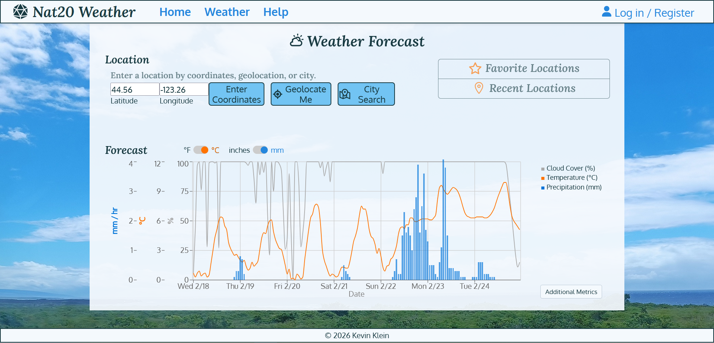

# Nat20 Weather App: README

---

## Overview
**Nat20 Weather** is a weather dashboard web app featuring geolocation, location search, search history, togglable metrics and units. This app was built for CS361: Software Engineering I, at Oregon State University to showcase a full-stack web app made with microservice architecture and designed with usability heuristics in mind.

---

## UI Preview


---

## Tech Stack
- **Frontend**: React (JSX, CSS Modules)
- **Backend**: Node.js (stateless serverless functions)
- **Database**: MongoDB (noSQL)

---

## Features
- **Weather Charting**  
  Display an hourly weather forecast for any location in the world based on OpenMeteo's forecast API.

- **Multiple Input Methods**  
  Enter a location via city search, browser geolocation, or manual coordinate entry.

- **Togglable Metrics**  
  Customize which metrics are displayed on the weather chart. By default: temperature, precipitation, cloud cover. Also available: apparent temperature, precipitation chance, humidity, wind speed.

  - **Search History**  
  Recently searched locations are displayed for user convenience, and can be permanently saved if the user creates an account.

---

## Future Improvements

- **Authentication**  
  Replace bcrypt hashing with Supabase API as authentication. 

- **Robust Validation & Error Handling**  
  Extend both client- and server-side validation, with clearer error messages and fallback handling for failed operations.

- **Decrease Latency**  
  Reduce number of REST calls and migrate unit conversion to front end. 

- **Host on Live Internet**  
  Use Vercel to host frontend and Supabase for backend API.

- **UX Design Fixes**  
  Improve mobile appearance and responsiveness.
  Automatically fetch best-guess initial weather forecast based on user's IP address.

```
